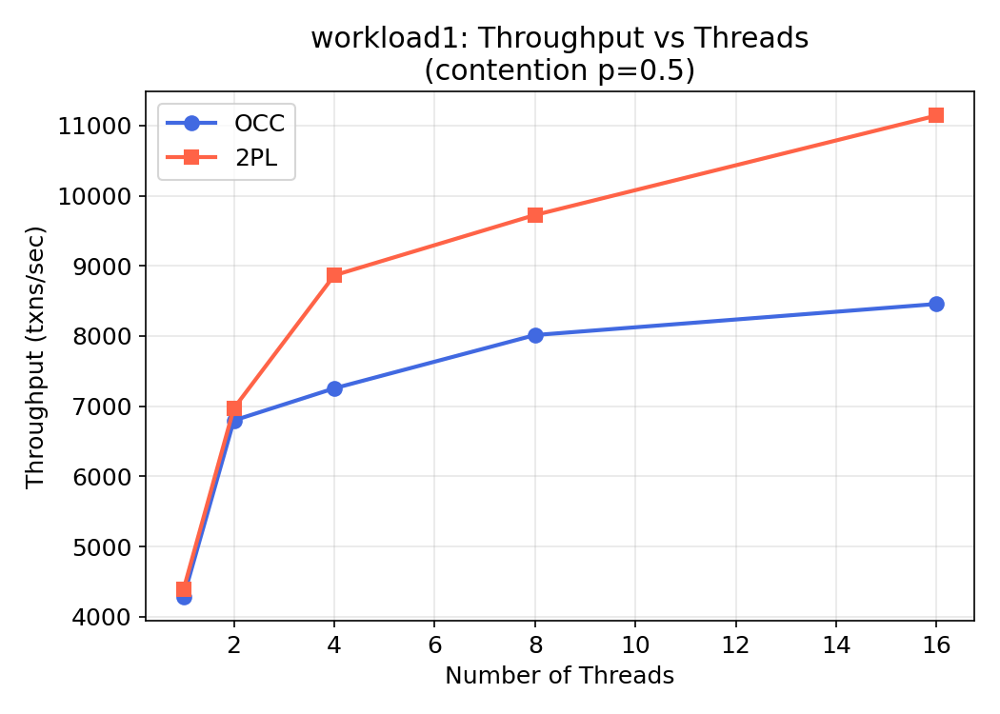
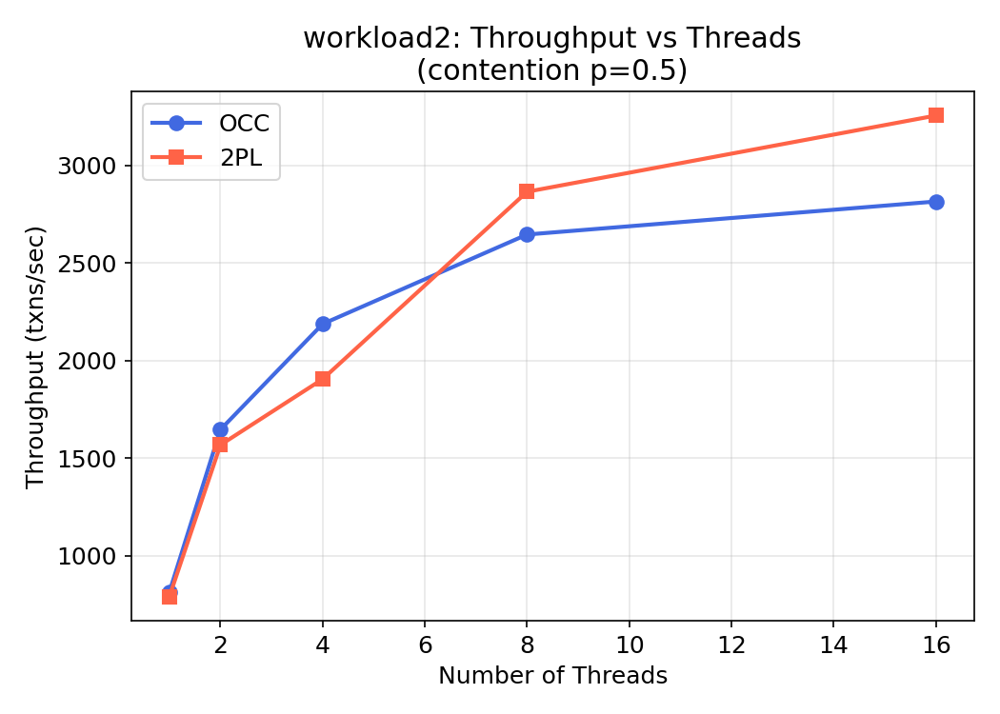
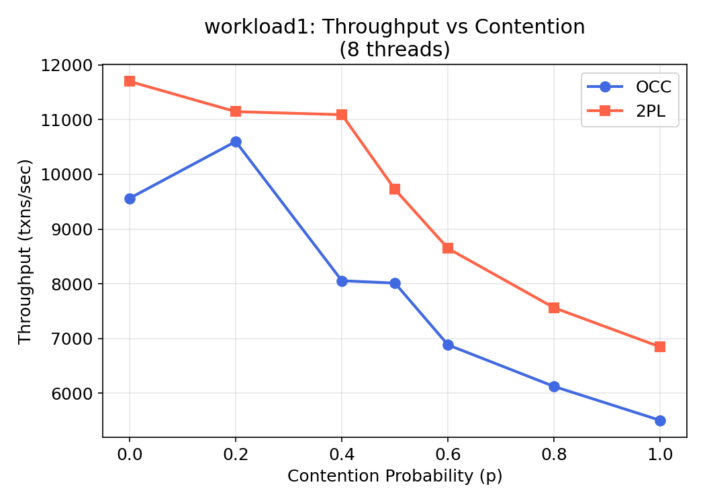
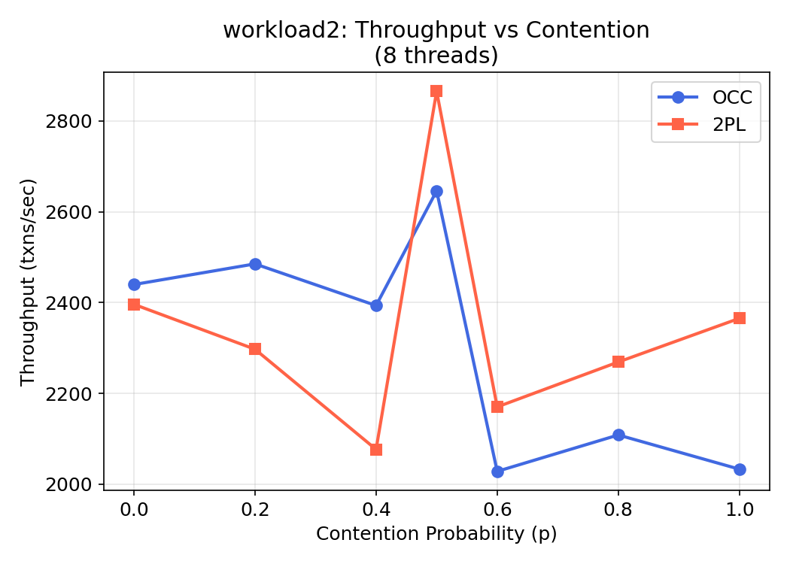
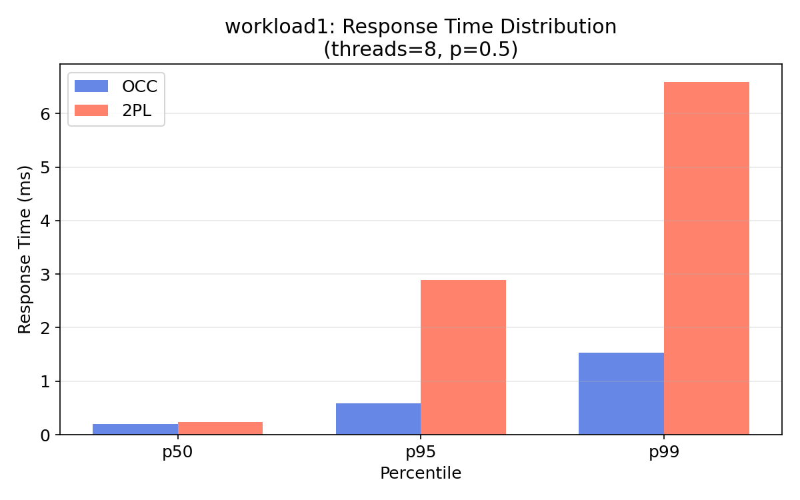
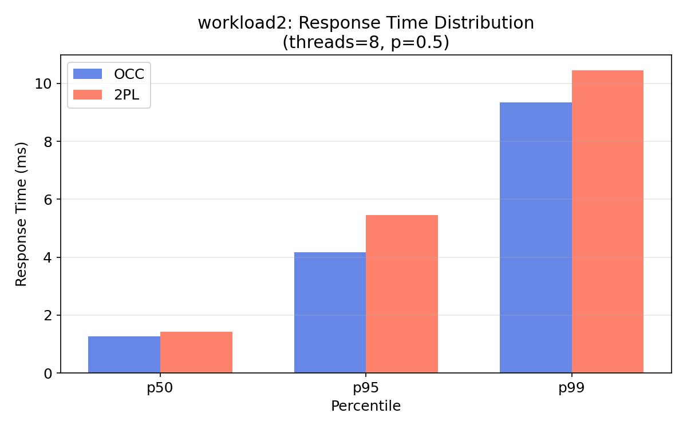
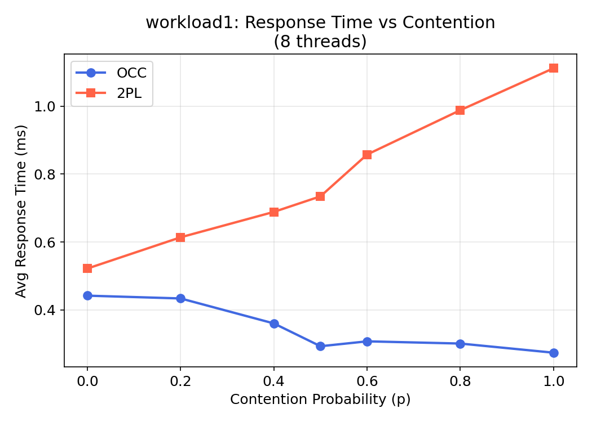
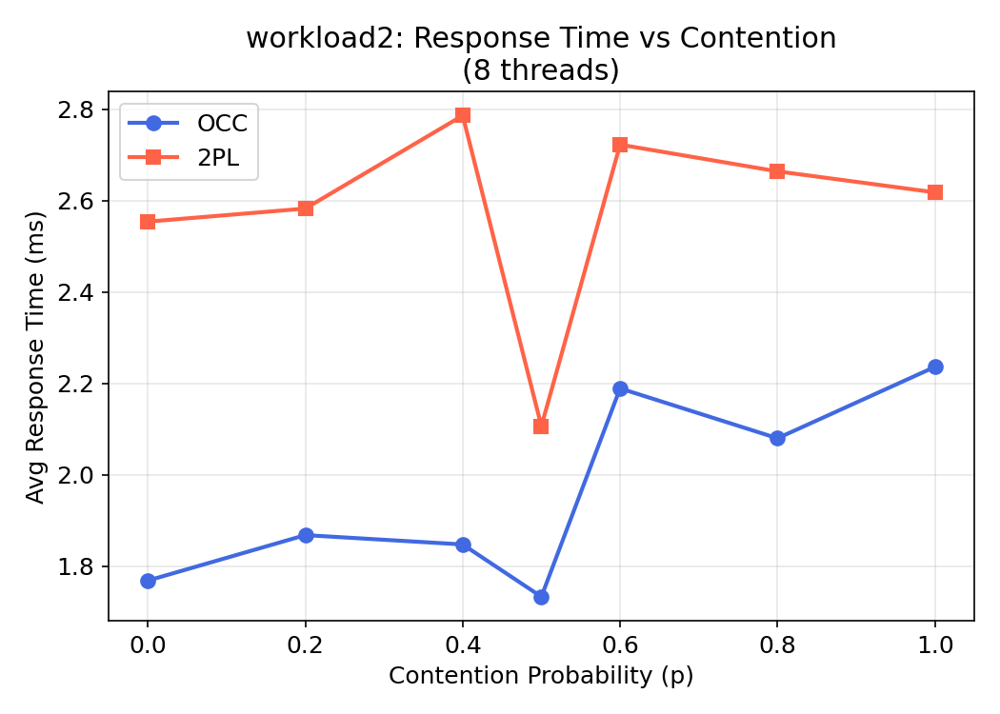
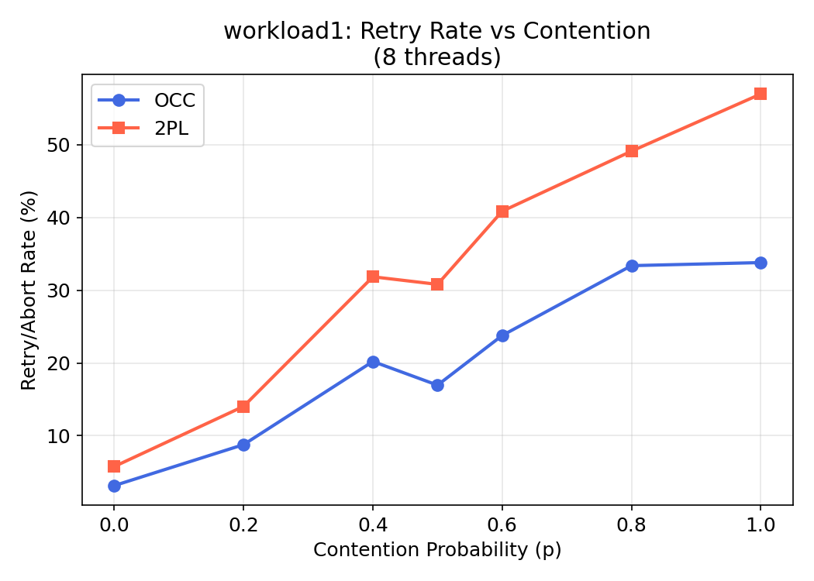
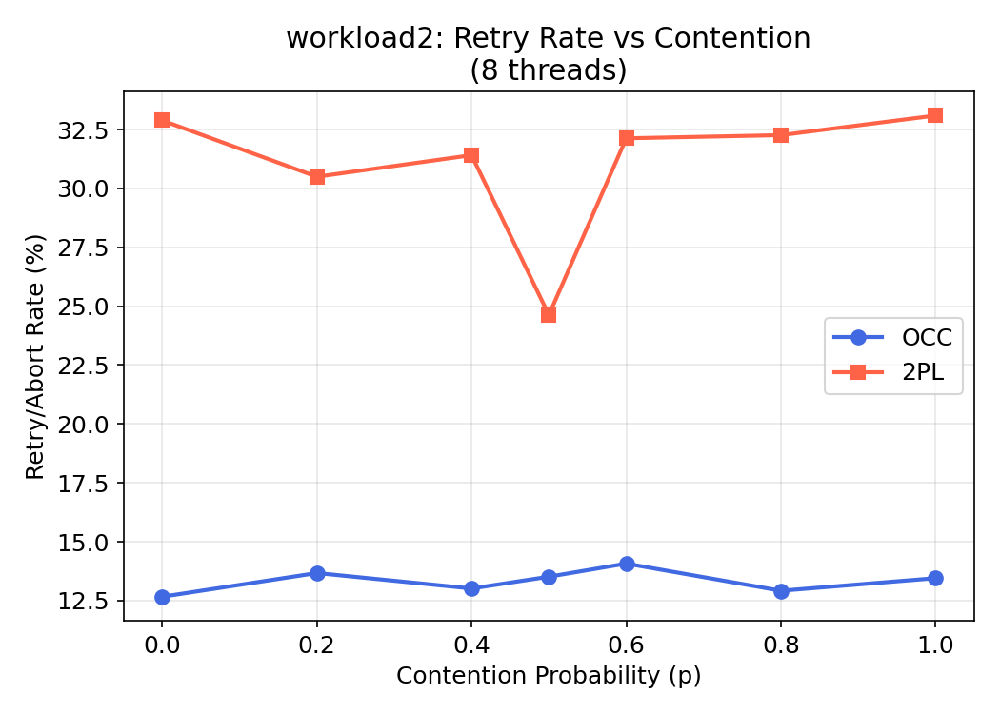

# Transaction Processing Engine

A multithreaded transaction processing engine implementing **Optimistic Concurrency Control (OCC)** and **Conservative Two-Phase Locking (2PL)** on top of RocksDB, with benchmarking tools to analyze throughput, latency, and retry behavior under varying contention and parallelism.

Built to explore the tradeoffs between optimistic and pessimistic concurrency control strategies in high-concurrency environments.

---

## Features

- **OCC** - read-phase, validation-phase, write-phase with exponential backoff and jitter on retry
- **Conservative 2PL** - all-or-nothing lock acquisition with livelock prevention via timestamp-based priority escalation
- **RocksDB storage layer** - persistent key-value backend with serialization/deserialization
- **Hotset-based contention modeling** - configurable hot key probability and hot set size
- **Benchmarking** - throughput (txns/sec), p50/p95/p99 latency, retry rate across thread counts and contention levels
- **Automated experiment runner** - sweep threads and contention for both protocols
- **Visualization** - Python plotting scripts for all benchmark results

---

## Dependencies

- **C++17** compiler (g++ ≥ 9 or clang++ ≥ 10)
- **CMake ≥ 3.14**
- **RocksDB** development library

### Installing RocksDB

**Ubuntu/Debian:**
```bash
sudo apt-get install librocksdb-dev
```

**macOS (Homebrew):**
```bash
brew install rocksdb
```

**From source:**
```bash
git clone https://github.com/facebook/rocksdb.git
cd rocksdb
make shared_lib -j$(nproc)
sudo make install-shared
sudo ldconfig
```

---

## Build

```bash
mkdir build && cd build
cmake .. -DCMAKE_BUILD_TYPE=Release
make -j$(nproc)
cd ..
```

The binary will be at `./build/txn_processor`.

---

## Running a Workload

```
./build/txn_processor [OPTIONS]

Required:
  --input <file>       Path to INSERT data file (e.g., workload1/input1.txt)
  --workload <file>    Path to WORKLOAD file (e.g., workload1/workload1.txt)
  --mode <occ|2pl>     Concurrency control mode

Optional:
  --threads <N>        Number of worker threads (default: 4)
  --txns <N>           Transactions per thread (default: 500)
  --hot-prob <0-1>     Hotset selection probability (default: 0.5)
  --hot-size <N>       Number of hot keys (default: 10)
  --db-path <dir>      RocksDB directory (default: ./rocksdb_data)
  --output <file>      Append CSV stats to file
```

### Examples

**Workload 1 with OCC, 8 threads, medium contention:**
```bash
./build/txn_processor \
  --input workload1/input1.txt \
  --workload workload1/workload1.txt \
  --mode occ \
  --threads 8 \
  --hot-prob 0.5 \
  --hot-size 10
```

**Workload 2 with Conservative 2PL, high contention:**
```bash
./build/txn_processor \
  --input workload2/input2.txt \
  --workload workload2/workload2.txt \
  --mode 2pl \
  --threads 8 \
  --hot-prob 0.9 \
  --hot-size 5
```

---

## Contention Modeling

Contention is modeled using a **hotset**:
- `--hot-prob p`: Each transaction selects keys from the hotset with probability `p`
- `--hot-size N`: Number of hot keys in the hotset
- Higher `p` or smaller hotset → more overlap between transactions → higher contention

| Scenario        | hot-prob | hot-size |
|-----------------|----------|----------|
| No contention   | 0.0      | any      |
| Low contention  | 0.2      | 20       |
| Med contention  | 0.5      | 10       |
| High contention | 0.8      | 5        |
| Max contention  | 1.0      | 5        |

---

## Running Benchmarks

```bash
# Build first
mkdir build && cd build && cmake .. -DCMAKE_BUILD_TYPE=Release && make -j$(nproc) && cd ..

# Run full benchmark sweep (threads and contention for both protocols)
chmod +x run_experiments.sh
./run_experiments.sh
```

Results are saved as CSV files in `results/`. Then generate plots:

```bash
pip install pandas matplotlib numpy
python3 plot_results.py
```

Plots are saved to `plots/`.

---

## Benchmark Results

### Throughput vs Threads
| Workload 1 | Workload 2 |
|------------|------------|
|  |  |

### Throughput vs Contention
| Workload 1 | Workload 2 |
|------------|------------|
|  |  |

### Response Time Distribution
| Workload 1 | Workload 2 |
|------------|------------|
|  |  |

### Response Time vs Contention
| Workload 1 | Workload 2 |
|------------|------------|
|  |  |

### Retry Rate vs Contention
| Workload 1 | Workload 2 |
|------------|------------|
|  |  |
---

## Architecture

```
main.cpp              CLI entry point
src/
  record.h            Record type (map<string,string>) + parser
  storage.h           RocksDB storage layer (put/get/getAllKeys)
  parser.h            Parses INSERT and WORKLOAD files into data structures
  executor.h          Interprets transaction template ops; evaluates expressions
  occ.h               Optimistic Concurrency Control (sequential validation)
  twopl.h             Conservative 2PL (all-or-nothing locking, livelock prevention)
  runner.h            Multithreaded workload runner with hotset key selection
run_experiments.sh    Bash script to sweep all benchmark parameters
plot_results.py       Python script to generate benchmark plots
```

### OCC Design
- **Read phase**: Reads records directly from DB without locking; buffers writes locally
- **Validation phase**: Acquires a global `validation_mutex` (sequential validation). Re-reads all keys in the read set and checks for modifications. Aborts if any record changed
- **Write phase**: Applies buffered writes atomically while holding the validation lock
- **Retry**: Exponential backoff with jitter

### Conservative 2PL Design
- **Lock acquisition**: Sorts keys alphabetically (consistent ordering), then attempts `try_lock()` on each
- **Failure**: If any lock is unavailable, all held locks are released immediately — no deadlock possible
- **Livelock prevention**: Monotonically increasing timestamps assigned per transaction. Transactions with more retries get shorter wait times (priority escalation). Random jitter desynchronizes competing threads
- **Release**: All locks released after writes are committed

---

## Output Format

Each run prints:
```
Mode:              OCC
Threads:           8
Committed:         4000
Retries:           312
Retry rate:        7.24%
Throughput:        3821.45 txns/sec
Avg response time: 2.08 ms
Response time p50: 1.43 ms
Response time p95: 6.71 ms
Response time p99: 12.30 ms
```

CSV output (one row per run) contains all the above fields, suitable for plotting.